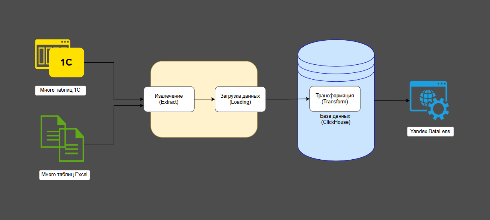
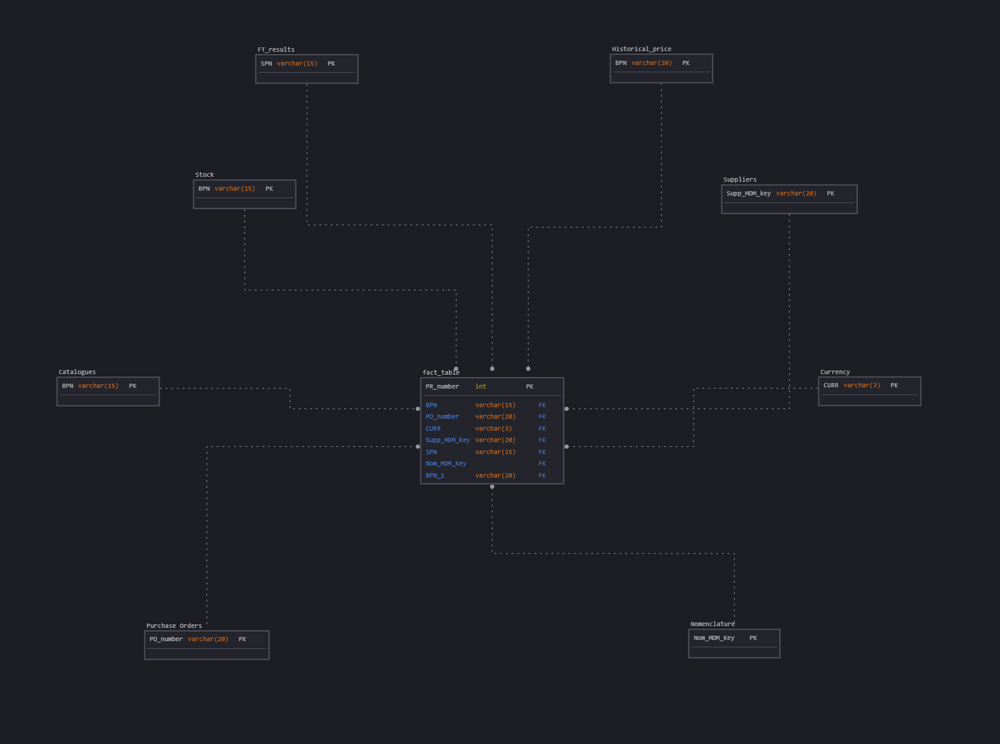
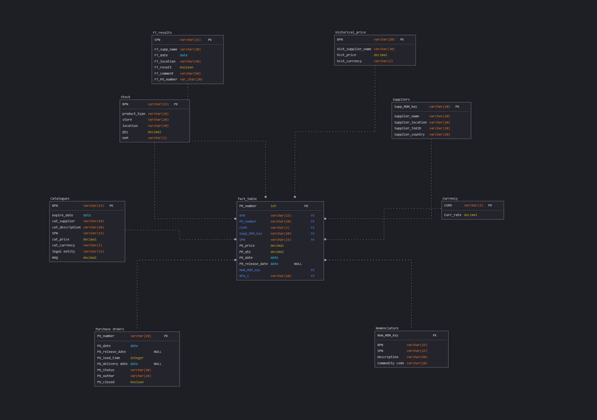
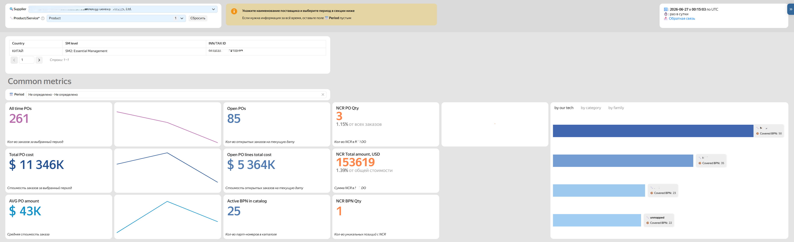
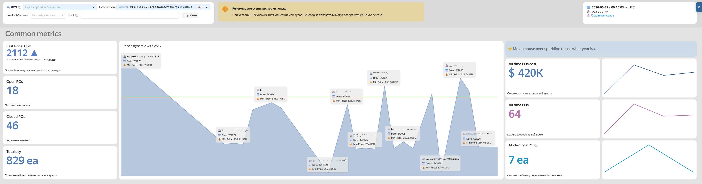
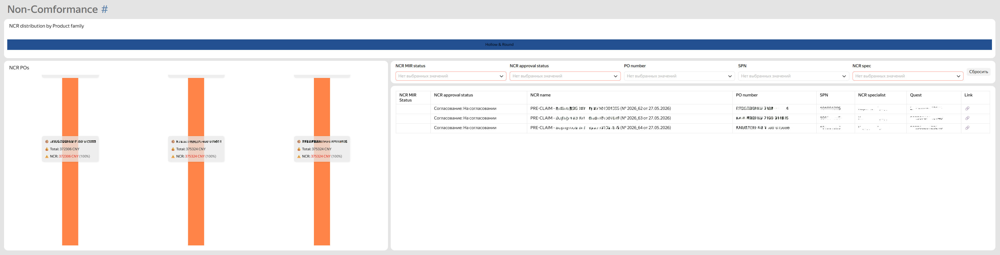

# 📦 Supply Chain Analytics Dashboard — витрина данных по локализации запасных частей

## 👋 О проекте

Это фрагмент реального коммерческого проекта по аналитике цепочки поставок и локализации запасных частей.

Проект демонстрирует полный цикл построения аналитического решения: от получения данных из операционных источников (1С, Excel) до ETL-обработки, моделирования данных в ClickHouse и построения BI-дашбордов в Yandex DataLens.

---

## 🧑‍💻 Моя роль

В рамках проекта я спроектировал и реализовал аналитический слой системы, включая:

- проектирование логической и физической модели данных;
- разработку SQL-витрины данных;
- реализацию ETL-логики и автоматизацию процессов с использованием Apache Airflow;
- консолидацию данных из разрозненных операционных источников;
- разработку BI-дашбордов в Yandex DataLens

---

# 🏗 Архитектура решения



Конвейер обработки данных:

- Источники данных: отчеты 1С и Excel-файлы
- ETL-слой: SQL-преобразования
- Хранилище данных: ClickHouse
- BI-слой: Yandex DataLens
- Пользователи: координаторы и специалисты по закупкам, категорийные менеджеры

---

# 🧩 Модель данных

## Логическая модель



## Физическая модель



В основе решения лежит схема «звезда», оптимизированная для аналитических запросов.

---

# ⚙️ Витрина данных (заказы)

Ниже приведен пример SQL-логики, используемой для построения аналитической витрины заказов.

Основные задачи данного слоя:

- объединение данных о поставках из нескольких источников;
- нормализация информации о поставщиках и заказах;
- расчет статусов исполнения заказов;
- расчет показателей просрочек и финансовых метрик в разных валютах.

Результатом работы является единая аналитическая таблица, которая используется в качестве источника данных для BI-дашбордов.

### Исходный файл

`sql/orders_mart.sql`

<details>
<summary>Показать полный SQL-запрос</summary>

```sql
...
```

</details>

---

# 📊 BI-дашборд (Yandex DataLens)

На основе сформированной витрины был разработан операционный BI-дашборд, обеспечивающий прозрачность процессов закупок, доступности запасных частей и эффективности поставщиков.

### Бизнес-результат

- Координаторы получили единое окно для контроля доступности деталей, вариантов заказа и открытых позиций.
- Ручная подготовка данных сократилась примерно на **4 часа в неделю**.
- Подготовка закупщиков к встречам с поставщиками сократилась с **1,5 часов до ~10 минут**.

---

## Аналитика эффективности поставщиков



---

## Аналитика материалов и запасов



---

## Анализ поставок с несоответствиями (Non-Conformance)


